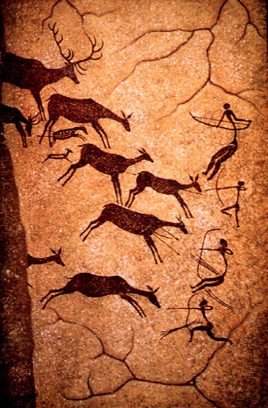
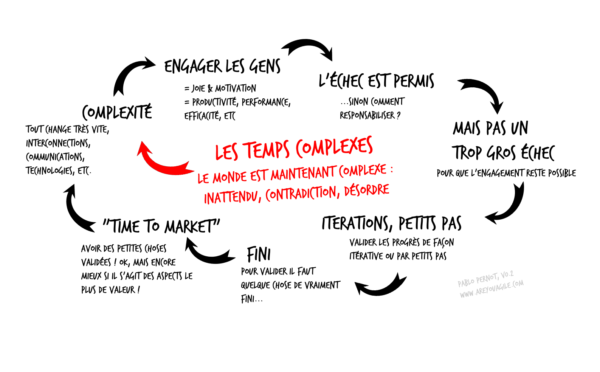
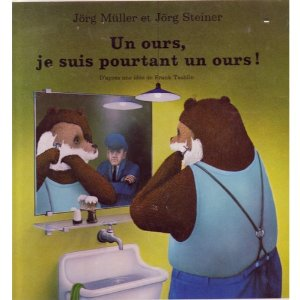
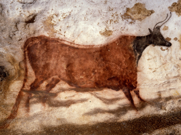

%LA HORDE AGILE
%« Qui ne transitionne pas se fossilise. », haiku préhistorique. 
%Version BROUILLON 014 – décembre 2013

\pagebreak

Voici le sujet de mes dernières conférences, en quoi l'*homo sapiens* que nous sommes peut nous aider à mieux comprendre nos organisations et nos projets dans le monde actuel. 

Préambule et Contexte : L'agile
===============================

J'appartiens -enfin je l'espère- au mouvement de pensée *agile*. Initialement, et encore aujourd'hui, ce mouvement porte sur l'organisation du travail, le savoir être et le bien être en entreprise. Il prend sa source dans les équipes de développement informatiques américaines, elles mêmes s'inspirant -en partie- de la pensée japonaise de l'après guerre (Toyota et le *Lean*, sorte de façon de penser l'organisation et le travail, voire au delà^[http://en.wikipedia.org/wiki/Lean_manufacturing]).

Si je devais te résumer succinctement en deux points l'*agile* :
 
* Premier point, l'agile acte de la complexité du monde moderne et y répond en proposant une responsabilisation de tous les acteurs. La responsabilisation amenant probablement une motivation et un bien être, l'organisation et la société ne s'en porteront que mieux. C'est ce que j'appellerai les temps complexes (voir plus bas). 

* Deuxième point, plus opérationnel, l'agile pousse à optimisation de la création de valeur par un compromis constant entre effort et valeur, ainsi qu'une interrogation constante sur l'amélioration. L'optimisation est quelque part entre l'ordre et le chaos, et sa recherche n'est pas prédictive, ni mécaniste, mais seulement empirique et adaptative. Comme dans la pensée systémique^[http://fr.wikipedia.org/wiki/Pens%C3%A9e_syst%C3%A9mique] : on ne fait pas de *suboptimisation* (c'est à dire que l'on ne peut pas optimiser une sous-partie, il faut optimiser le *tout*).

Finalement, l'agile devrait être perçu comme un état d'esprit, une culture, a *way of life* comme pourraient le dire les américains ; ou encore, de façon un peu plus pédante j'en conviens mais assez juste : l'agile c'est une culture de l'évolution dans un monde complexe.

Durant mes réflexions à mes collègues, camarades et amis j'ai du me mettre à manier une image, une métaphore, une analogie : celle de la horde agile. Pourquoi ? j'essaye de te l'expliquer. 

\pagebreak

Histoire de la horde agile
==========================

Pas le code, pas les pratiques, la culture !
---------------------------------------------

Bon elle vient d'où cette horde agile ? C'est quoi cette horde agile ?

En fait comme le mouvement de pensée agile vient du monde informatique et donc la place du code y est prépondérante. Le matériel premier de ce métiers c'est le code, le langage informatique. Mais j'ai toujours pensé et je pense encore que la culture agile dépasse de beaucoup la manipulation du code. Elle peut être appliquer dans tous les domaines car c'est d'abord culturel. Cette horde agile c'est d'abord, initialement, une volonté de de faire passer ce message. 
 
Donc cette horde agile est apparaît d'abord dans une discussion de café avec les copains, moment où je cherche justement à expliquer  :  L'agile c'est une culture et un savoir être. Le code n'est qu'un moyen donc on s'en fout (là je les provoque sciemment, les copains, j'y reviendrai avec de meilleurs sentiments plus tard : le monde du code a été le lieu où la première fois la culture agile est apparue). Ah comment leur expliquer mieux ? Ce n'est pas antinomique avec le code naturellement, c'est juste pas au même niveau de lecture. Il me fallait trouver une application de l'agile qui n'avait rien à voir avec le code. Et une application qui parle à tous, même à toi ? Je me suis alors demandé pourquoi je ne pourrais pas évoquer nos ancêtres, les australopithèques, les *homo habilis*, *homo erectus* et *homo sapiens*, qui risquaient leur vie à mener leurs projets, et -à mes yeux, instinctivement- de façon agile.

Emballé par l'idée j'ai creusé celle-ci : imaginez l'histoire de deux hordes préhistoriques, une qui porte les idées que je défends, l'autre non. Une façon très stimulante pour moi d'évoquer cette culture que je défends. J'espère que le mot *horde* ne vous gène pas, mon intérêt pour celui-ci m'est probablement venu en lisant « la horde du contrevent »^[Alain Damasio, La horde du contrevent] que m'avais suggéré Antoine Vernois^[Antoine Vernois, http://antoine.vernois.net/]. Comme dans ce livre ce qui défini cette horde c'est son aspect « combinatoire », ce qui émerge de la combinaison supplante ce qui fait la force de chacun de ses membres. On est déjà dans les idées agiles que je cherche à défendre. Et non pas du tout comme la horde freudienne de *Totem & Tabou* dominée dans le sang par le mâle alpha. En anglais il faudrait donc traduire plutôt « pack^[Conversation avec Dan Mezick] » que « herd » (où l'aspect *animal* est trop présent).

Bref, imagine ces deux hordes, l'une composée de Cro-magnons (*homo sapiens*), agiles, et l'autre des hommes de Néanderthal, non agile, et qui allaient donc échouer, disparaitre. Vous allez me dire que c'est une caricature totalement farfelue (on sait que l'humanité des hommes de Néanderthal valait celle des cro-magnons, et que probablement il y a eu des mélanges) et vous avez raison, dîtes vous que c'est juste un prétexte.

Imaginez donc deux hordes face au défi du changement climatique. Le changement climatique les oblige à changer leur camp de base. L'une va finalement se perdre dans les tréfonds d'un glacier, les hommes de Néanderthal naturellement, l'autre saura déjouer les pièges de la nature, l'inattendu, l'imprévu, ils sont les *agilistes*, car c'est le coeur de l'agilité que de gérer l'inattendu. Je vulgarise souvent l'agilité à une capacité d'adaptation, d'évolution dans un monde complexe. Cette idée de la tribulation de deux hordes m'allait donc bien.

Des indicateurs oui, des chiffres non
-------------------------------------

A y réfléchir, je me suis dit qu'un deuxième thème pouvait aisément se glisser dans le monde de ces deux hordes. Les fameux indicateurs chiffrés demandés à tout bout de champs dans beaucoup des projets actuels, et sensés garantir leurs réussites, ou nous alerter. Dans l'agile on estime que beaucoup de ces indicateurs ne sont pas les bons, sont inutiles, voire nocifs. En utilisant l'histoire des mes hordes je pourrais mettre en évidence qu'aucun indicateur chiffré n'est présent, et que nonobstant elles mettent leurs vies en jeu dans un projet. 

Ainsi si dans mon activité d'accompagnement d'organisations je bataille constamment avec ces fameux indicateurs : « donne moi des chiffres » dit le client glouton, « mon ROI (retour sur investissement), ma performance, ma productivité. Est-ce que je suis meilleur ?». Les chiffres ça les rassurent mais cela répond rarement à leurs vraies questions. Dans la horde agile que je te propose d'imaginer, pas de chiffre, et pourtant des indicateurs (on avance, on atteint la grotte prévue, on a faim on ralentit, etc), et un projet réussi (ou pas) : on a réussi à atteindre notre nouveau camp (ou pas). 

Voilà donc les deux sujets exprimés grâce à cette horde agile : a) la culture agile (bien au delà de pratiques ou de mise en oeuvre) ; b) une remise en cause des indicateurs chiffrés habituels. 

Sur ce Laurent Sarrazin m'a proposé une fin de week-end d'ajouter mon grain de sel à la seconde édition de Rupture douce^[Laurent Sarrazin, Rupture douce, saison 2]. Grain de sel, ou perturbations comme le dit Laurent, sous la forme d'une rapide nouvelle tenant sur une page.  Du coup, et tenant émotionnellement à mon histoire de *horde agile* qui me trottait dans la tête (suite aussi à la parution d'un petit article sur celle-ci^[Are you agile ? http://www.areyouagile.com/2013/02/la-horde/]), j'ai écrit une petite histoire, assez naïve je vous l'accorde. 

\pagebreak

Petite nouvelle
---------------

"Qui ne transitionne pas se fossilise."
haïku préhistorique. 
    
C'est le matin,l'humidité a rempli la grotte, il se réveille doucement et hume l'air. La nuit a été froide. Il retire sporadiquement les quelques feuilles qui lui ont servis de matelas et qui lui sont restées collées dessus, et se dirige vers l'entrée de l'anfractuosité qui a servi de refuge à la horde cette nuit, 4ème lune de leur grand voyage. 

Il a pris place sur le seuil de cette cavité, les rayons de l'aube lui caressent le visage, ce visage anguleux au duvet foisonnant, ils'interroge. 

Il est fier. 

Il est fier de tout ce chemin parcouru, se retourne lentement et passe en revue les membres encore endormis de la horde. Fier et anxieux, car chaque jour semble s'ouvrir sur de nouveaux défis. Plus la horde avance, plus les prédateurs sont nombreux et variés, les fruits de la cueillette ne sont plus les mêmes. Il faut constamment s'adapter, compter sur la horde pour trouver des opportunités dans ce milieu changeant.

Mais sous les rayons chauds du soleil il sourit. Il est évident que la horde a toujours trouvé une solution aux défis que la nature lui lançait. Parfois de façon inespérée : nos lances aux pointes acérées ne viennent-elles pas des jeux d'enfants autour du feu découvrant que le bois ainsi brulée proposait une étonnante résistance ?

Il sourit et se détend, la horde est là. Chacun n'y joue pas son rôle, mais chacun à un rôle à y jouer. Le partage et l'apprentissage y sont la règle. Jusqu'à présent, et d'après les récits des anciens, on n'a jamais su prédir où chacun allait s'épanouir et exceller. 

Les cousins Néanderthal que l'on ne croise plus guère ces temps-ci n'ont jamais compris cette leçon. Leur horde est fragile. Il ne remettent rien en cause, ni hiérarchie, ni façon de faire. Ils ne comprennent pas. Ils ont du se faire dévorer par ces nouveaux prédateurs.

Il sourit et se détend car il a compris que lui et sa horde sont bien différents des autres espèces qu'ils croisent. Ils s'adaptent, évoluent, se nourrissent de la pensée des autres membres. Sa horde est à l'image de la nature : elle se contorsionne comme cette branche pour contourner l'obstacle. Elle a la violence d'une piqûre de rose mais aussi son parfum. Elle possède ses saisons, ses individus, si différents, mais dépendants et complémentaires. 

Il sourit et se détend et se prend à rêver qu'un jour cette plaine qu'il a sous les yeux lui appartiendra. 

Il est 7h00, et un réveil strident se met à sonner  au milieu de cette plaine désormais couverte de béton. Quelqu'un ouvre difficilement les yeux. Il est temps d'aller au boulot. Comme tous les jours, faire les mêmes gestes, obtenir les mêmes réponses, tenir sa place, son rôle, dans la hiérarchie. Pourtant tout en cette personne crie que la réponse n'est plus adaptée, qu'il faut changer, bouger, évoluer, que le monde lui n'a jamais arrêté de se transformer. 

Il est temps de se rappeler ce qui a permis à cet ancêtre, dont le visage était caressé par les rayons matinaux du soleil, et à sa horde, de parcourir un tel chemin. 

L'aliénation et le retour de la complexité
------------------------------------------

Voilà. C'est naïf je te le disais. Mais l'idée de la horde prenait de plus en plus forme. Et soudain, quelques mois plus tard, cela m'a frappé, je venais de régurgiter une histoire profondément enfouie en moi, l'histoire d'une bande dessinée de mon enfance, quand j'avais alors sept ou huit ans, et qui m'avait, je ne sais pourquoi, fascinée. La bande dessinée s'appelait : « Un Ours, je suis pourtant un ours » (de Jorg Muller & Jorg Steiner). (De mémoire) c'est l'histoire d'un ours qui sort de sa torpeur hivernale, et alors qu'il s'éveille découvre qu'un immense chantier est en cours juste au dessus de sa grotte. Il est encore groggy mais un contremaître passe par là et l'alpague : « qu'est ce que tu fais là ?? au boulot !! ». « Mais je suis un ours » répond-il. « Tu es surtout flemmard et mal poli, allez va te raser et au boulot ! ». Ensuite c'est l'engrenage, l'ours se retrouve complètement dans la peau de l'ouvrier -jusqu'à donc se raser- (c'est un livre très politique en fait je crois...) et se plie complètement au pouvoir en place malgré quelques dénégations. Viens l'hiver suivant, il est pris d'une grande mélancolie, l'hibernation l'appelle de toutes ses forces et il ne cesse de geindre « un ours, je suis pourtant un ours ». Je ne sais plus comment le livre fini. Mais mon histoire sur cet homme moderne -qui fut un *homo sapiens* parcourant les plaines- et qui se réveille dans le costume de l'ouvrier métro/boulot/dodo. C'est exactement le même sujet : celui de l'aliénation. Être étranger à soi-même. Ne plus suivre sa nature mais une habitude aliénante. 

Voilà je crois une synthèse de mes réflexions de départ sur cette horde agile. 

D'abord une volonté de montrer ce qu'est la culture agile, la culture que je défends, par un exemple qui fascine tout le monde (les hommes préhistoriques) et totalement détaché de tout contexte. Ensuite montrer l'inanité de nombreux indicateurs et récompenser l'intuition, les tripes, toujours par le biais de cette horde. Son intelligence collective basée sur la combinaison de ses profils. Enfin l'aliénation dont nous faisons preuve aujourd'hui trop souvent vis à vis de ce que nous sommes. 

\pagebreak

Nous sommes tous des *homo sapiens*
====================================

Finalement à réfléchir à cette horde agile, je commençais à m'y attacher, voire à m'y projeter grandement. Et puis je suis arrivé à la conclusion de milliers de personnes : Lucy, tu sais l'australopithèque découverte par Yves Coppens^[Yves Coppens, l'homme l'afrique le singe], 3.2 Millions d’années. Le Néolithique, ~ -13000 année avant Jimmy Page^[Jimmy Page, http://www.jimmypage.com/], c’est l’époque où l’homme devient agriculteur, et donc sédentaire, il arrête d'être ce célèbre chasseur/cueilleur, ce nomade, en tribu, en clan, en horde dans la Savane. Ainsi si nous nous mettons à compter : (11000/3200000)\*100 = 0.34%, 0.34 pourcent de notre temps en société sédentaire. *Grosso modo*, si on fait une analogie avec une journée de 24h, même pas 5 minutes en société sédentaire. Et nous voudrions que ces 5mn remettent complètement en question les 24h qui précèdent ? Nous sommes tous des *homo sapiens*, nous sommes tous des membres de cette horde. 

Alors c'est quoi être un *homo sapiens* ? Que pourrions nous réapprendre de nous même ? 

Le chiffre de dunbar
---------------------

Bien je vous propose de commencer par évoquer le chiffre de Dunbar. Robin Dunbar est un anthropologue, spécialisé dans le comportement des primates. Il a mis en évidence un chiffre -celui de Dunbar (*cqfd*)- représentant le nombre maximum de relations sociales, que je nommerai convenable, entretenue, que nous puissions a priori avoir. C'est à dire qu'à partir de ce nombre les villages de nos ancêtres se scindaient. Nous ne sommes pas bâtis pour avoir correctement plus de cent cinquante (c'est approximative cela le chiffre de Dunbar, de cent quarante à deux cents) relations sociales (bizarrement il se dit que le nombre moyen d'amis *facebook* se situe à cent cinquante huit...)^[ceci ne semble plus vrai, en 2012, le chiffre est vraisemblablement autour de 230. Cela annonce-t-il un décrochage de facebook ?]. Ainsi il faudrait éviter les départements de plus de cent cinquante personnes, l'information, la connaissance s'y délitent. C'est d'ailleurs ce qu'avait décidé de faire Steve Jobs alors qu'il conduisait le département *Macintosh* chez *Apple* : son nombre magique était cent, il s'interdisait d'avoir donc plus de cent personnes dans le département. 

Mary Poppendieck, la papesse du *Lean Software Developpement*, a tiré un excellent article^[Mary Poppendieck, Before there was management, http://www.leanessays.com/2011/02/before-there-was-management.html] des recherches de Dunbar  (« before there was management »), et introduit encore un autre concept de Christopher Allen, sur le chiffre de Dunbar et le plaisir d'appartenance à un groupe, selon la taille du groupe. C'est à dire que vous vous sentez plus ou moins bien dans des groupes selon leurs tailles^[Are you agile ? - http://www.areyouagile.com/2011/06/appartenance-a-un-groupe-et-niveau-de-satisfaction/]. Un groupe de sept personnes est excellent pour le moral, ou de cinquante, mais surtout pas de treize, quatorze, quinze, seize ! On connaît tous l'impact du moral, du bien-être dans la qualité de notre travail, c'est l'un des *mojos* du mouvement agile : responsabilisation et bien être des acteurs (pour la performance en plus, bingo). Je ne sais plus de qui cela vient mais j'avais beaucoup aimer : "l'enthousiasme fait les compétences". 

Voici donc un premier enseignement fort de la nature de nos ancêtres, voici un premier enseignement de ce que nous sommes : vous êtes à la tête d'une structure de mille personnes, que faire ? Vous la divisez en départements de cent cinquante maximum, disons sept départements de *grosso modo* cent cinquante, eux mêmes divisés en sous-groupes de cinquante, eux mêmes divisés en équipe de sept^[Sur les organisations agiles à grande échelle ce petit article : http://www.areyouagile.com/2013/11/agile-a-grande-echelle-cest-clair-comme-du-cristal/]. 

Verbal Overshadowing
---------------------

Autre chose, le verbal *overshadowing* (prononcez « ovaire chat dos oui gueux »).

C'est une histoire racontée par Dan Roam^[Dan Roam, Blah blah blah, http://changethis.com/manifesto/show/88.01.BlahBlahBlah], celle d'un clan (à chacun ses mots), celui de la grotte au taureau  (oui vous pouvez penser aux peintures rupestres de notre Lascaux). Dans son clan, au fond de la maison, on a dessiné un taureau (pensez Lascaux). Je ne peux pas vous dire à quoi il sert, on ne sait pas avec certitudes à quoi les peintures rupestres servaient, mais j'ai bien quelques idées : montrer la cible, invoquer un Dieu, un outil d'apprentissage, etc. En tous cas il était là, au milieu de la salle à manger, visible de tout le monde, personne ne pouvait l'ignorer, personne ne pouvait l'oublier.

Quelques années plus tard, beaucoup plus tard en fait, chez les égyptiens, on découvre le même -quoi que différent- taureau, dans les hiéroglyphes. Probablement les scribes qui notent la marchandise qui défile sur le Nil. Mais bon au fil des années on trouve compliqué de dessiner tous ces taureaux... donc on prend un raccourci, le symbole du taureau devient un son, et non plus vraiment un taureau, ce qui permet d'écrire une phrase. C'est vrai pour certains symboles (ils deviennent des sons, des *phonogrammes*), mais pas tous (certains restent des *pictogrammes*). Un vrai casse tête cette histoire, ce mélange, ces hiéroglyphes, il faudra bien un *self made man* français et dyslexique pour en trouver la clef, Champollion. 

Enfin viennent les Phéniciens qui marchandent avec nos égyptiens. Pas mal le coup des symboles pour les sons, mais autant simplifier le dessin non ? C'est le son « Alf », qui vient du hiéroglyphe « taureau » qui devient la lettre « aleph » dans ce nouvel alphabet. Ensuite en passant dans les mains des grecs le symbole changera encore un peu et la lettre « A » appartiendra à l'histoire. (Avec la lettre A imaginez la tête du taureau avec ses cornes, renversée, à l'envers).

C'est une belle histoire, mais c'est aussi un drame qui s'est joué là : le mot, le verbe a éclipsé toute notre capacité à communiquer visuellement (par dessin, par forme, par image quoi), et tous les avantages et inconvénients qui en résultèrent.

Deux études démontrent, a) que notre cerveau fonctionne bien mieux avec les images notamment pour tout ce qui est lié à la mémoire^[Cela a aussi été repris par John Medina dans Brain Rules : http://www.brainrules.net/] ; b) mettre des mots sur des évènements dégradent notre capacité à s'en rappeler correctement. Pour Dan Roam, nous avons oublié et perdu cette capacité de communication visuelle qui était pourtant au cœur de notre horde. 

Qu'est ce que cela nous enseigne ?  Que si vous souhaitez retenir quelque chose convenablement un dessin, ou un motif, est bien plus efficace qu'un ensemble de mots. Et ça nous l'avions complètement oublié, et c'est ce que nous rappelle l'agile, le *lean*, etc : bon sang utilisez des tableaux visuels, qui ne sont pas autre chose que des motifs picturaux. (crénom, comment a-t-on fait pour oublier qu'un dessin valait mieux qu'un long discours ou qu'un fichier *excel* ?).

J'ajoute un élément important la dimension physique, tactile est aussi très important pour le cerveau et la mémoire. Croyez vous que les homo-sapiens touchaient leurs dessins... sans doute. Je ne parle donc pas d'outils électroniques. En fait plus il y a de sens (ouïe, touché, vue, odorat), plus la mémoire fonctionne bien, plus la résolution de problème est efficace. 

Résumons : un certain dimensionnement des groupes, des équipes, des organisations, et une communication visuelle (pictogramme) et tactile, quoi d'autre ? 

Né pour courir ensemble 
------------------------

Une conférence TED de Christopher McDougall^[Christopher McDougall, born to run, http://www.ted.com/talks/christopher_mcdougall_are_we_born_to_run.html] aborde aussi la horde (c'est Alexis Monville qui m'avait glissé cette référence). Que nous dit-il ? Il reprend une idée qui a fait son chemin parmi les théories des paléontologues^[« Hunter, Gatherer », wikipedia.] : la force première de notre horde fut de courir, et courir, et courir, une course de marathoniens, pas d'arme (et oui, nous n'avons ni carapace naturelle, ni dents longues et acérées), mais l'endurance du groupe. En fait notre force fut de savoir … suer^[L'irrésistible Stéphane Langlois m'indique une alternative : la station debout aurait développé l'amplitude des poumons nous permettant ainsi de courir longtemps]. Et donc de courir sur de longues distances. Surprise, la course de marathonien est de nos jours l'un des rares sport ou vous réalisez les mêmes performances à dix-neuf ou soixante ans (votre pic de performance se situe à vingt sept ans). Cela serait du à notre capacité héréditaire qui viendrait donc notre ancienne horde, la course, le marathon, suer. Il faut donc imaginer une horde qui pourchasse une antilope dans la Savane. Une longue traque où finalement l'antilope s'épuise, se rend, et se laisse tuer par la horde. 

Cela implique un scénario intéressant : La horde, le pack comme dit Christopher McDougall est très important. On ne coince pas une antilope seule, c'est le pack qui l'encercle, la contraint. Cette horde doit posséder des aînés qui savent quelle antilope choisir et pourquoi. Les femmes enceintes et les jeunes du groupe doivent suivre au même rythme, c'est eux qui ont le plus besoin des protéines de l'antilope, inutile si ils suivent six kilomètres plus loin. La horde doit avoir des costauds, ceux qui achèvent l'antilope en bout de parcours. Les jeunes comme nous l'avons dit doivent être présents, aussi car cela constitue un formidable apprentissage pour eux, ils assistent à toute la traque.

Cette horde est donc constituée de différents profils nécessairement collaboratifs. Notre arme, notre carapace à nous, c'est la collaboration, la coopération.

Combinaison collaborative de personnes, voilà, d'après les hypothèses de McDougall (et bien d'autres) à quoi correspondait notre horde. Grâce à cette combinaison collaborative on obtient une chose que l'on aurait pas obtenu seul. Comme les lionnes dont les embuscades collectives fournissent deux fois plus de proies que la chasse en solitaire^[Sociétés animales de Jacques Goldberg]. Premier pas dans la pensée systémique : la somme du groupe n'équivaut pas à la somme de ses constituants. Notre horde est spécialisée pour la marche, le marathon, peut-être comme le sous-entend McDougall, j'y vois surtout son aspect social la valeur générée par la combinaison de ces personnes, cette combinatoire : matière du groupe, qui sans le groupe n'existe pas. 

Je ne parle pas non plus d'hyperspécialisation! tout le monde participe à la chasse, tout le monde y prend sa part. Le membre de la horde est un polytechnicien nous dit Henry Laborit si il existait de nos jours^[Henri Laborit, La nouvelle grille]. 

C'est ainsi que fonctionne les équipes agiles, les organisations agiles : une collaboration/coopération accrue, et une approche systémique, le groupe n'équivaut pas à la somme de ses constituants. 

La chasse n'est pas un événement anodin souligne Edgar Morin^[Edgar Morin, Le paradigme perdu : la nature humaine] dans « Le paradigme perdu : la nature humaine ». La chasse habilise, habilite, [...] met au prise l'intelligence avec ce qu'il y a de plus habile et de plus rusé dans la nature […], la chasse intensifie et complexifie la dialectique pied-main-outil-cerveau […]. La chasse c'est le moment clef de la constitution de ce que nous sommes, et ce moment mettrait en exergue notre capacité et nécessité de collaborer, l'intérêt du combinatoire.

Je retiens donc de notre horde : des groupes de sept, cinquante, cent-cinquante, du management visuel pour une meilleure mémorisation et résolution de problème, des groupes hétérogènes, endurants et collaboratifs. 

Psychologie évolutionniste
---------------------------

1,2,3 soleil, vous savez le jeu ? Et bien j'imagine qu'avec les prédateurs ou les proies, pour se cacher cela devait être un passage obligatoire dans le *gameplay* de la horde. Le jeu comme apprentissage cela ne vous dit rien ? Et la puissance du *storytelling* des histoires, ou des métaphores, la tradition orale, tout cela ne vous dit rien dans nos organisations agiles ? Sûr que la horde connaissait cela aussi. Imaginez l'ainé de la horde racontant comment s'y prendre lors de la chasse devant le taureau de Lascaux.

Quoi d'autre ? Si un grand bruit surgit du fond de la salle dans laquelle vous vous trouvez, vous allez sursauter, et vous retourner brusquement en arrêtant immédiatement tout ce que vous êtes en train de faire. Si subitement une odeur forte apparaît, vous vous tournez immédiatement vers sa source, votre corps se tend (c'est encore plus vrai avec les odeurs qu'avec les sons, le cerveau prend directement en compte les odeurs sans une série de validations à l'inverse des autres sens^[Antonio Damasio, L'erreur de Descartes]).

Ca aussi c'est notre horde qui nous l'a appris, ou plutôt nous avons accumulé ce comportement si je peux le dire ainsi. Notre espèce a survécu à moults dangers. Nous avons accumulé un connaissance, des habitudes, un savoir^[Pour creuser cette notion d'accumulation lisez « Un univers complexe » de Marc Halévy qui suggère l'idée non pas du passé, du présent et du futur, mais d'une accumulation de temps (le temps est alors un produit et non pas une contrainte). Le passé est alors une couche qui pourrait être accessible depuis le présent.], je reprends le mot, important il me semble, une histoire, ce que nous appelons une connaissance innée (comme la mésange qui sans jamais n'avoir fait de nid de mésange sait faire un nid de mésange) qui dictent nombres de nos comportements. L'intuition est juste la mise en oeuvre de cette connaissance, basée sur ce que nous sommes, et ce que nous avons été. 

Rien n'est simple je n'accorde pas non plus à l'inné une trop grosse importance. Seulement qu'on a fortement eu tendance à oublier qui nous sommes, et que cet inné là existe bel et bien. 

A travailler sur ces questions je suis tombé sur un mouvement que je ne connaissais pas, mais dont j'aurais pu me douter de l'existence : la psychologie évolutionniste ; mouvement qui prend son essor en 1973 avec l'acceptation de l'importance de l'instinct.

En 1973, le prix Nobel de physiologie ou médecine remis à Konrad Lorenz, Karl von Frisch et Nikolaas Tinbergen pour *«l'organisation et la mise en évidence des modes de comportement individuel et social»*, seul prix Nobel jamais remis à des spécialistes du comportement, a eu une influence considérable sur la psychologie mondiale. Désormais, il n'était plus question de négliger la part de l'instinct chez l'homme^[Psychologie évolutionniste http://fr.wikipedia.org/wiki/Psychologie_%C3%A9volutionniste].

Cette psychologie évolutionniste nous dit -je vulgarise ce que j'en ai compris- : tout comme les espèces sont le fruit de l'évolution, la constitution de notre terre le fruit de son évolution, notre cerveau et ses capacités et façons de raisonner, notre psychologie, est lui aussi le fruit de notre évolution. 

D'où aussi probablement dans mes lectures à ce sujet la forte présence des biologistes de formation, ou de personnes faisant référence régulièrement à la biologie: Henri Laborit^[Henry Laborit, La nouvelle grille], Dominique Dupagne^[Dominique Dupagne, La revanche du rameur], Edgar Morin^[Edgar Morin, Le paradidme perdu : la nature humaine. ], Henri Atlan^[Henri Atlan, entre le cristal et la fumée], ou Marc Halévy^[Marc Halévy, Un univers complexe.]. 
 
Nous sommes ce que nous sommes et avons été en quelque sorte. Cela surprend quelqu'un ??? Et j'ajoute un mot d'Edgar Morin qui résume définitivement cette idée : « notre nature est notre culture, et notre culture est notre nature ». Voilà ce que nous rappelle et nous enseigne la horde agile. Notre façon de faire les choses, notre culture, est notre nature. Notre nature est en grande partie celle de cet hominidé qui parcourait les steppes. 

Pas de raisonnement sans émotion
---------------------------------

Bon je reviens à mon exemple : nous sentons une odeur indésirable : tous nos sens sont en éveil (cela pourrait être un prédateur), c'est la part instinctive de nous même qui nous a mis en alerte. Instinct d'autant plus fort que tous ce qui passe par les odeurs court-circuitent certains points de contrôle du cerveau^[John Medina, Brain Rules]. Sans aller jusqu'à des comportement aussi automatique, quand vous êtes confrontés à des choix basés sur des raisonnements cette part « d'instinct »,  continuons à l'appeler ainsi, est-elle présente ? 

Pour nous français, patrie de René Descartes, c'est dur d'imaginer cela : je pense donc je suis, je raisonne d'une façon cartésienne, lieu où l'émotion (plutôt que instinct) n'a pas sa place. Ne vous en faîtes pas pour les anglo-saxons ce n'est pas non plus simple, ils ont eu Isaac Newton. Or vous avez compris, Descartes ou Newton peut-être, mais les milliers d'années de notre apprentissage avec notre horde sont là, et aucun de nos raisonnements ne se fait sans émotion, sans l'irruption de notre nature. Ou mieux encore : aucun bon raisonnement ne se fait sans émotion, au corps défendant de René Descartes. 

Antonio Damasio^[Antonio Damasio, L'erreur de Descartes] est un médecin, chercheur, qui s'est penché sur l'aventure d'un certains Phineas Gage^[http://en.wikipedia.org/wiki/Phineas_Gage], celui-ci alors qu'il travaillait pour le chemin de fer américain a vu une impressionnante barre de métal lui traverser le cerveau et le priver d'une bonne partie de celui-ci (devant, au dessus de l'oeil gauche), mais cette partie était le lieux des "émotions sociales". Étonnamment l'homme ne s'est pas plus mal comporté dans les jours et mois à venir. Sauf qu'aucun de ses raisonnements à moyen ou long terme ne tenaient plus la route, et que toute sa vie sociale s'est désagrégée. Alors qu'avant son accident Phineas Gage avait tout de l'homme qui réussissait. 

Au travers de cette histoire et d'une multitude d'autres analyses Antonio Damasio en arrive à la conclusion que nul raisonnement ne fonctionne sans émotion. Sa prise de position fait date et c'est désormais la théorie officielle. C'est aussi ce que dit la psychologie évolutionniste : on ne saurait raisonner ex-nihilo, depuis le vide, tout ce que nous sommes, notre nature, notre émotion, notre culture est embarqué dans nos raisonnements. 

Il ne faut donc pas être surpris si l'agile et ses prémisses le Lean (oui j'ai pensé longtemps que l'agile était le rejeton du Lean, erreur ! Le Lean est le signe avant-coureur -et encore immature- de l'agile^[ceci est pour les débats de puristes]) émergent dans les environnements les plus cartésiens, les plus hostiles à l'inattendu, là où la réalité a été la plus insupportable pour les tenants du tout calculable, du tout prédictif. 

Le Lean et surtout l'agile sont les fruits d'une culture dont le raisonnement n'est pas entièrement cartésien (je n'ai pas dit qu'il n'était pas cartésien du tout hein), ou qui valide et accepte la part émotionnelle de chaque raisonnement. 

C'est donc probablement par rejet dans les lieux les plus cartésiens qu'ils sont apparus. Dans l'industrie automobile, là où le taylorisme a été poussé à son paroxysme pour le Lean. Dans la création logiciels informatiques, au sein des équipes informatiques, le lieu du code, le lieu du binaire, du bits. Hérésie et vieilles dentelles, chaines de montage, logiciels informatiques, c'est au sein de structures où le cartésianisme devait prouver sa validité la plus totale qu'il a volé en éclat^[Le code, berceau de l'agilité, http://www.areyouagile.com/2013/10/le-code-le-berceau-de-lagilite/]. 

Nous pensons donc maintenant qu'aucun raisonnement ne tient sans émotion. Et que les émotions et nos raisonnements reposent en partie sur ce que nous sommes et avons été. Problème : dans beaucoup d'environnements cette approche plus sensible, plus intuitive est aux antipodes de la culture ambiante. Dans les projets informatiques la *rationalisation chiffrée* vit des heures heureuses. Nous sommes en train de dire qu'il est essentiel de changer tout cela. 

Remise en question de notre orthodoxie cartésienne
--------------------------------------------------

*« Depuis Descartes nous pensons contre-nature », Edgar Morin^[Edgar Morin, le paradgime perdu:la nature humaine]*. 

Mais bon sang pourquoi gérer vos projets avec des chiffres ? 

Qu'il s'agisse des mathématiques pur et simple (complètement remis en cause par exemple dans l'infiniment petit), ou de calculs infaisables car trop complexe (trop de paramètres), on ne peut pas utiliser de l'arithmétique pur pour gérer nos projets. De nombreux auteur (dont particulièrement le « univers complexe » de Marc Halévy) vous donneront de nombreuses explications que je ne maîtrise pas forcément, sur la fin mathématique de l'absolutisme du mouvement de pensée de Descartes et Newton. 

« La méthode cartésienne, fer de lance de la méthode scientifique, a vécu. Les systèmes, phénomènes et processus complexes ont clairement et irrévocablement démontré les limites et impasses de ces approches là. Fin du réductionnisme, fin du mécanisisme, fin de l'analycisme. […] Les sciences de la complexité -par essence- sont des domaines pluridisciplinaires, transdisciplinaires : on ne comprendra rien à l'évolution du cosmos si l'on ne comprend pas bien la logique du déploiement d'un arbre ou la logique de composition d'une symphonie. La science n'est plus compartimentale. Elle est une. » nous dit Marc Halévy^[Marc Halévy, Un univers complexe]. 
  
En cela il s'inspire fortement de Edgar Morin qui ajoute : «C'est évidemment toute la structure du système de pensée qui se trouve bouleversée, transformée, c'est toute une énorme superstructure d'idées qui s'effondre. Voilà à quoi il faut s'apprêter. »^[Edgar Morin, Introduction à la pensée complexe]

Non seulement on sait désormais qu'aucun raisonnement n'est valide sans émotion. Mais on doit aussi apprendre à faire confiance à nos émotions et apprendre à abandonner la précision inhumaine de cet arithmétique qui ne correspond pas à notre réalité : nous vivons dans des contextes systémiques. Stop le mécanisisme, le rationalisme. Il faut briser ces barrières artificielles. 

### Le singe enivré

En parlant de rompre les silos, les barrières, une petite parenthèse sur la théorie du singe enivré de Terence McKenna^[Terence McKenna, Foods for the gods] qui je pense trouve sa place au sein de la horde... Terence McKenna developpe l'idée -très intéressante- que le grand changement dans l'évolution et notamment l'essor inexplicable, ou très extraordinaire, des capacités mentales de nos ancêtres (cela démarre vers 4000 000 d'années avant Jimmy Page) n'est pas venu de la station debout (rendu déterminante dans la Savane) qui a libéré nos ancêtres. Mais le changement de régime alimentaire. En effet en se retrouvant dans la Savane du fait des changements climatiques, non seulement nos ancêtres doivent marcher, mais aussi manger différemment. Et là ils mangent des ... champignons hallucinogènes. Lesquels ouvrent des pans entier dans leurs capacités intellectuelles (on sait que le psilocybin augmente fortement l'accuité visuelle par exemple). Or ces effets deviennent des avantages déterminants dans l'évolution. Ils rompent aussi les barrières dans les compartiments de nos cerveaux (n'oubliez pas l'*homo sapiens demens* de Edgar Morin, notre caractéristique est d'avoir du désordre. Nos rêves sont désordonnés, pas ceux des animaux^[Je ne sais pas comment les scientifiques savent cela...mais bon, lisez Edgar Morin, le paradigme perdu : la nature humaine], est-ce un héritage de notre régime alimentaire ?). Bref Terence McKenna pousse sa théorie à penser que le langage est venu de cette loghorrée engendrée par l'état de trance. Sa théorie est riche, spectaculaire, gonflée, mais pas moins intéressante, et envisageable. 

Approche systémique
------------------- 

Est-ce que notre horde avec des indicateurs chiffrés ? Non. Est-ce qu'elle mettait sa vie en jeu ? Oui. 
Je sais par expérience que si j'ai une équipe de 20 personnes, que je multiple 20*(4*0,25) (soit 4 quart de journées) pour avoir plein de petits quarts de journée de production à placer comme bon me semble, et bien cela ne marche pas. 

Je sais par expérience que si je retire deux membres d'une équipe de six, et bien la productivité de l'équipe va doubler... des fois, et des fois s'effondrer, avec les même personnes dans les deux cas. 

Approche systémique et donc complexe s'il en est.  « La pensée complexe ne refuse pas du tout la clarté l'ordre et le déterminisme, elle les sait insuffisants, elle sait qu'on ne peut pas programmer la découverte, la connaissance, ni l'action »^[Edgar Morin, Introduction à la pensée complexe]. 

Mais alors il n'est plus possible d'avoir des indicateurs me dites vous, horrifiés ? Si ! Mais ces indicateurs seront des tendances, des estimations. Qu'il ne faudra pas trop jouer avec les chiffres mais plutôt : observer les faits, se prémunir d'aller trop loin sans feedback.  N'ayez pas peur.

Et les indicateurs cela sera surtout des choses achevées, abouties, concrètes. Combien de ventes ? Cette partie qui marche « là tu vois ! », cette grotte que l'on atteint « oui on y est ». 

**les feuilles excel cela ne marche pas !**^[La seule chose dont je me rappelle concernant l'opuscule de Henrik Kniberg "Scrum & Xp in the trenches", c'est la phrase : "excel sucks"])

Comme le disais Marc Halévy^[Marc Halévy, Conférence pour la ligue des optimistes, 2013] dans une conférence : pensez à tous vos grands choix de vie : votre compagne, compagnon, choisir de se marier ou pas, votre métiers, vivre à tel endroit plutôt que tel autre, avoir des enfants ou pas,  etc. ont-ils été soupesés avec un calcul froid cartésien. Non, ils sont le fruit d'un raisonnement et de vos émotions conjointements, et tant mieux. Il nous dit que les grandes décision de vie sont des décisions intuitives. Et la psychologie évolutionniste nous dit que l'intuition n'est pas du tout une pulsion creuse, mais qui s'emplit de tout ce que l'humanité a été.

Aucun raisonnement purement cartésien, nos raisonnements s'appuient nécessairement sur nos émotions. Nos émotions, ce que nous sommes, nous en héritons depuis des millénaires, nous avons été façonnés autant physiquement que psychologiquement, qu'émotionnellement. 

Il faut donc à nouveau revenir à la phrase clef de Edgar Morin, comprendre que nature et culture sont indissociables. Notre activité et plus encore nos raisonnements sont dictés par notre culture, comprenez notre nature aussi, au regard des milliers d'années que nous avons vécu.

Enfin, savoir que nous avons des prédispositions comportementales issues de notre héritage évolutif ne veut pas dire que nous ne pouvons pas avoir de contrôle sur les effets indésirables de ceux-ci dans notre société actuelle. Mais connaissons nous nous même et sachons exploiter ou contre-balancer certains phénomènes.

Incertitude, contradiction, désordre
-------------------------------------

« Ce que la pensée complexe peut faire, c'est donner à chacun un mémento, un pense-bête, qui rappelle : n'oublie pas que la réalité est changeante, n'oublie pas que du nouveau peut surgir et de toute façon, va surgir », Edgar Morin^[Edgar Morin, Introduction à la pensée complexe. ]. 

« Large corporations or government bureaucracy could exist and do the job so long as the environment for which they were designed remained essentially unchanged. At the moment, however, we have a new situation wherein we must deal with highly complex organizations in very fast moving environments », Harrison Owen^[Harrison Owen, Spirit].

Notre culture, notre nature, sont faites pour évoluer dans un monde complexe, incertains, avec des pensées parfois désordonnées. Bonne nouvelle, c'est le monde d'aujourd'hui. L'agile, la culture de l'agile, c'est l'acceptation de cela. Cette cuture agile c'est l'acceptation de l'incertitude, de la contradiction, du désordre. 

Pour moi, et j'espère pour nous, pour vous, acceptez la complexité c'est accepter : l'incertitude. Il faut donc se donner du temps. Mais plus encore c'est accepter la contradiction (que je manie avec aisance et sans honte comme vous l'observez...). Il faut laisser l'auto-organisation, la responsabilisation agir. Cette incertitude et cette contradiction entraine une part de désordre qui n'est d'autre qu'une voie vers l'évolution, l'amélioration. Pour citer Franck Zappa^[Rappelez à mon bon souvenir récemment, et dans ce cadre, par Dan Mezick] : « pas de création sans déviation de la norme » : cela aurait pu être une citation de Lamarck ou Darwin. C'est le désordre dans les pensées et dans les rêves qui a fait de l'homme, l'homme si l'on en croit Edgar Morin^[Edgar Morin, « le paradidme perdu : la nature humaine »]. C'est une idée séduisante. L'évolution vient d'ailleurs d'anomalies.

La complexité ne recherche pas le désordre, mais c'est un de ses éléments. Je ne suis pas en train de vous dire qu'il faudrait de l'incertitude constamment, de la contradiction de tous les instants, et vivre dans un beau désordre. Non, je dis simplement que ces éléments sont liés à la complexité, à notre évolution dans ce monde complexe, que nous sommes complexe, que le monde est complexe. Et c'est pour évoluer, progresser, dans cette complexité (ah bon sang ce terme si difficile à contenir, je plussoie énormément quand Dominique Dupagne^[Dominique Dupagne, La revanche du rameur] explique que le mot « agile » c'est simplement un mot plus sexy pour attrapper la notion de complexité) que j'invoque la horde.

Auto-organisation et storytelling
----------------------------------

J'avais évoqué rapidement plus le *storytelling* comme mode d'apprentissage. Et aussi la responsabilisation et l'autonomie comme réponse agile à la complexité du monde (que nous venons d'évoqué). Cette responsabilisation, autonomie, le mieux serait de l'appeler auto-organisation. Or l'auto-organisation est une caractéristique naturelle de tous systèmes vivants (*les systèmes humains comme tous les systèmes vivants, sont auto-organisés, et plus loin il assène : organiser un système auto-organisé, ce n’est pas seulement un oxymore, c’est surtout stupide !* vitupère d'ailleurs Harrison Owen^[Harrison Owen, Dancing with shiva, TEDx conference]

Storytelling, auto-organisation, complexité sont intimement liés.

L’apprentissage c’est l’intégration de motifs. Plus on apprend plus on intègre de motifs pour différencier les situations. Le bruit et le désordre existent,et donc de nombreux motifs se ressemblent mais sont différents. On créé alors de plus en plus de motifs pour répondre à notre apprentissage grandissant. Ainsi le désordre génère de l’ordre (de plus en plus de motifs) mais dans un ensemble de plus en plus complexe. C’est ce qui constitue en fait ce que nous sommes, nos histoires, d’où le storytelling, c’est notre passé, nos motifs mémoriels. C’est notre conscience volontaire nous dit aussi Henri Atlan^[Henri Atlan, entre le cristal et la fumée], mais elle concerne ainsi d’abord le passé.

L’auto-organisation est un phénomène naturel de tous les systèmes vivants, auxquels nous n’échappons pas. Ce que précise Henri Atlan c’est que l’auto-organisation est introduite par le désordre, auquel il faut répondre, comme vu au dessus pour générer des motifs (de l’ordre). L’auto-organisation c’est cette phase d’apprentissage non dirigé (par un professeur par exemple) qui à pour but de générer des motifs. Cette auto-organisation dévoile selon Henri Atlan notre volonté inconsciente (et ainsi le futur, vers quoi nous tendons), puisque nous essayons de créer de l’organisé en partant du chaos selon nos désirs.
Enseignements

Plusieurs enseignements :

* C’est bien le désordre qui génère de la valeur car il est la matière pour de nouveaux motifs, pour un nouvel apprentissage.
* L’auto-organisation c’est cette faculté des systèmes vivants à transformer ce bruit, ce désordre en motifs, en histoire, le chaos en ordre. Mais en faisant cela, l’apprentissage augmente, ainsi que la complexité : l’entrelacement des motifs mémorisés.
* L’histoire peut-être considérée comme un idéal motif mémorisé.
* L’auto-organisation et le storytelling sont donc intrinsèquement liés. Il y a une forte relation de feedback de l’un avec l’autre.

Maladie organisationnelle

Henri Atlan explique ensuite certains troubles psychologiques, le délire évoqué par Edgar Morin dans son paradigme perdu, par des systèmes figés, ou l’apprentissage n’a plus lieu : c’est donc le même motif, immuable, que l’on retourne constamment (et qui prend la forme de délire chez l’homme). Le lien avec une maladie organisationnelle me parait évident : pensez à Kafka, on est figé dans des motifs où l’apprentissage n’a plus lieu, que l’on répète constamment. Pensez aux organisations dont les processus sont figés, qui n’apprennent plus de nouveaux motifs liés aux variations que l’organisation rencontre (nécessairement). Une organisation sans auto-organisation est une organisation malade, délirante^[voir aussi : http://www.areyouagile.com/2013/12/auto-organisation-et-storytelling/].

Première Conclusion
-------------------

Nous ne serons que meilleurs en exploitant ce que nous sommes intrinsèquement. 

Notre nature est notre culture, et notre culture est notre nature pour reprendre Edgar Morin

Notre culture nourrit nos comportements. 

Notre nature et notre culture ne sont pas enclins à un cartésianisme absolutiste. Les systèmes et dynamiques de nos projets agiles ne sont pas conformes avec une rationalisation forte, avec un déterminisme « définitif » en quelque sorte. 

On pourrait même pousser l'analogie avec l'évolution. Qu'est ce qui a survécu et pourquoi ? Peut-on s'en inspirer ? Attention il y a des différences, rien n'est simple (complexe ? Vous avez dit complexe ? Tiens comme c'est complexe). Par exemple la nature prend son temps : entre productivité et innovation il faut choisir. La nature essaye plein de choses, elle ne regarde pas à la dépense elle, elle a le temps.

On parle souvent en agilité de conception émergente, y voyant la panacée dans notre monde complexe d'une approche créative ou productive. Nous ne faisons rien de plus que de mettre ainsi en pratique ce que le monde n'a cessé de faire : essayer, observer, émerger (ou « Plan, Do, Check, Act » de Edward Deming,  le « essayons, testons, réparons », du Lean) : « marche bipède, grimper et petites dents à l'émail épais : c'est Orrorin ; marche bipède, grimper et grosses dents à émail mince : c'est Ardipithecus ; marche bipède exclusive et grosses dents : c'est Australopithecus anamensis ; marche bipède, grimper et face projetée, c'est Australopithecus afarensis, etc^[Préface de Yves Coppens, dans Origines de l'Homme et évolution culturelle de Fiorenzo Facchini]. »

\pagebreak

Critiques
==========

Dominance et territorialité
----------------------------

J'entends :« Mais la horde ce n'est pas cette meute avec ce chef qui s'impose par la force, viole les femelles et mange ses enfants (comme Cronos) ? »  « Et si tu invoques notre nature, tu ne peux pas ne pas évoquer la hiérarchie forte de la nature humaine, cet instinct de domination ». Hiérarchie, dominance, territorialité, l'analogie, le rappel de la horde n'amène pas que des aspects positifs. 

Oui, je suis embêté dans ma réflexion, je ne peux pas dire d'un côté : il faut se rappeler d'où nous venons pour mieux exploiter ce passé dans notre présent, car il nous colle à la peau en quelque sorte, et d'un autre côté passer sous silence certains aspects moins agréables, ou plus en porte à faux avec le discours agile : hiérarchie, dominance. 

On sait que le besoin de dominance, d'imposer une hiérarchie, est un comportement très fréquent, pas obligatoire, mais très fréquent chez la plupart des espèces, qu'il est proportionnel (le besoin de dominance) à l'absence de territorialité (en gros plus il y a de territoire -et de ressources associées- moins il y a de besoin de hiérarchie, et inversement)^[Sociétés animales de Jacques Goldberg]. 

D'abord, il faut faire avec...ou pas. C'est le discours de Henry Laborit^[Henry Laborit, La nouvelle grille] : savoir qui nous sommes, pour mieux comprendre et agir. Et ainsi comprendre ce besoin inextinguible de compétition. Le discours est repris par Dominique Dupagne^[Dominique Dupagne, La revanche du rameur], qui reprend une théorie actuelle la compétition démarre aux niveaux des gènes. Donc on peut commencer par se dire : tout n'est pas bon à reprendre, à rappeler. Comment distinguer le bon grain de l'ivraie, je n'ai pas de recette, je fais appel à votre intelligence. C'est aussi potentiellement un indicateur de l' effort qui va devoir être réalisé pour aller contre-culture, contre-nature^[C'est une chose que la psychologie évolutionniste indique : nous ne sommes plus adaptés au monde qui nous entoure (faut-il réadapter le monde plutôt que de chercher à nous adapter...peut-être?)]. 

Cependant concernant la hiérarchie, la dominance, la compétition en contre point de la collaboration et la coopération il n'est pas aussi certain qu'elles soient si ancrée en nous. Nous parlions de l'importance de la chasse, c'est l'un des rares moments chez les espèces animales (et donc on peut imaginer chez l'homme) où la hiérarchie disparaît, s'efface pour la collaboration.
 
Et puis une autre surprise, confronté à ce problème, et creusant certaines sources je m'aperçois que cette lecture entre compétition et coopération est un sujet de débats au sein de la communauté scientifique. Que aujourd'hui bien des anthropologues et autres personnes s'intéressant à la question sont d'accord pour dire que la coopération a longtemps primée dans l'évolution de l'humanité sur la compétition qui n'est que bien plus récente.
 
« Du point de vue de l'évolution, la coopération plus que la compétition ou l'agressivité, à du jouer un rôle assez important au sens où elle a représenté, avec d'autres expression de la culture comme le langage et la technologie lithique, un facteur d'évolution et de succès pour l'espère humaine » nous dit Fiorenzo Facchini^[Fiorenzo Facchini, « les origines de l'homme »]. 

En fait si la compétition, la hiérarchie et la dominance naissent de la territorialité et des ressources restreintes alors cela nous ramène dans les 5 minutes de la journée de 24h évoquée initialement. A la période du Néolithique (-13000 avant JP). 

Facchini enchaine : « La coopération est étroitement liée à la phylogénèse humaine et elle correspond à une orientation profondément enracinée dans la nature humaine. La compétition et la lutte pour la survie individuelle et pour celle du groupe correspondent elles aussi à une disposition de la nature humaine, mais en tant qu'agressivité, dans un but de conquête et de domination, elles semblent avoir été acquises relativement récemment comme le soutiennent de nombreux chercheurs (Fromm, Wright, Childe, ...) »^[Fiorenzo Facchini, « les origines de l'homme »].

L'auto-organisation, la coopération comme élément majeur de l'évolution de la culture et de l'histoire de l'homme. L'agressivité, la domination comme élément récent et nouveau liés à la territorialité. 

Oui les chasseurs/cueilleurs sont connus pour leurs sociétés égalitaires^[C'était aussi l'un des effets des champignons hallucinogènes de Terence McKenna si on opte pour sa théorie : le champignon a changé la nature humaine pour en faire un être coopérant en groupe. Et encore lui aussi pense que c'est cela qui fut déterminant dans notre évolution. L'hallucination aurait rendu caduque toute volonté de domination, mieux (ou pire) encore, les hallucinations de groupe auraient provoqué des orgies, et donc la paternité aurait été quelque peu dissoute dans le groupe. Je vous laisse vous délecter de ces histoires dans Food of the Gods...] : les hommes sont égaux avec les femmes (quel recul depuis!). C'est d'ailleurs une différence flagrante avec nos cousins les chimpanzés par exemple. Les paléonthologues^[Hierarchy in the forest / Evolution of Egalitarian Behavior de Christopher Boehm] vont même plus loin et affirment que notre résistance à la domination a conduit à la création de la conscience, du langage et de l'organisation sociale^[« Hunter, gatherer », wikipedia].  Ils ajoutent : les chasseurs/cueilleurs (même ceux qui ont survécus jusqu'à nos jours) n'ont pas de chef permanent : c'est celui qui prend l'initiative selon les tâches qui devient le leader naturel...

Belle nouvelle nous sommes au fond de nous même non pas des dominants mais des coopérants. Et nos équipes agiles se comportent comme des chasseurs/cueilleurs (avec souvent du *leadership* naturel^[le leadership naturel peut être remis en cause à tout moment, c'est fondamental])...

Romantisme désuet ?
--------------------

Bon voilà où me mène mes réflexions sur notre culture, notre nature, et l'application de tout cet héritage  dans nos métiers actuels. Et puis soudain au détour d'une lecture (je ne sais plus laquelle), patatras, quelque chose du genre :  « cette capacité à faire appel au bon sauvage, pour rappeler un certain bon sens, pour conspuer le monde moderne est assez classique dans l'histoire de l'humanité, comme ce fut le cas avec Rousseau lors des Lumières, etc. ». 

Ai-je sombrer dans un romantisme désuet vain et classique de la pensée humaine en faisant appel au bon sauvage car j'aurais du mal à retrouver mes repères dans notre monde moderne ? Est-ce que à l'instar de mon beau-père (oh bon sang...) j'ai ressorti le fameux : « c'était mieux avant  » ? 

Est-ce que c'est juste idiot d'envisager un apprentissage de notre horde de nos jours ? Même la psychologie évolutonniste nous indique que l'un des problèmes de l'homme actuel c'est souvent la non-adéquation de ce qu'il a été avec le monde moderne. Pourquoi vouloir y revenir ? Et ne pas chercher à progresser ? Conservatisme ?

Je vois déjà certains prospects, clients, me dire : "oui oui pablo, si si intéressant, mais non, nous sommes une boite moderne nous, vos histoires d'hommes préhistoriques c'est sympa mais cela ne nous concerne pas. »

C'est dommage vous êtes arrivé jusqu'à ces lignes pour rien peut-être finalement. Un vrai gachis. Un naufrage. 

Pourtant j'écoute mes tripes et elles me disent que cette histoire n'a rien de passéiste et que le futur y est présent.

Deux réponses. 

La première rapide vient de Claude Levi-Strauss : les primitifs ne sont pas culturellement sous développés. Ils possèdent des organisations complexes qui n’ont rien à envier aux nôtres en termes d’élaboration intellectuelle et culturelle. Compte tenu de l'étendu de ses connaissances, l'homo-sapiens serait un polytechnicien dans notre monde nous dit Henry Laborit^[Henry Laborit, la nouvelle grille]. Donc pas de dénigrement. On peut s'en inspirer. On pense aussi qu'ils étaient en bonne santé, et travaillait 6,5 heures par jour (au lieu des 8,8 constatées en moyenne aujourd'hui)^[« Hunter, gatherer », wikipedia] (rythme soutenable?). Je le répète, on peut s'en inspirer.

Pour la seconde, arnachez vous, cela peut sentir le mode Guru. Je ne crois pas qu'il s'agisse d'un délire mystique mais malheureusement au premier contact cela en a l'apparence (comme d'habitude avec le new age, le souci ce n'est pas le fond, c'est la forme). Je vous la livre plus bas. 

\pagebreak

Ouverture
==========

Spirale dynamique
------------------

Encore un biologiste, Clare Graves, à l'origine de la Spirale Dynamique^[Fabien & Patricia Chabreuil, La spirale dynamique.], c'est bon signe.  La spirale dynamique nous propose un outil pour lire l'évolution du monde, des sociétés et des mentalités, de la culture collective et individuelle en quelque sorte, une description de la maturité des civilisations pourrait-on presque dire. 

La spirale dynamique nous dit que notre action est portée par notre vision du monde , laquelle est issue de principes, croyances, valeurs^[Jacques Ferber, slides : Spirale dynamique] ;  bref de notre culture. Elle redit ce que je m'efforce à comprendre : notre culture est notre nature, notre nature est notre culture, nos actes émanent de notre culture/nature. Ces visions du monde, cette culture, émanent aussi des conditions de vie auxquelles nous sommes confrontés. Et le monde est redevenu complexe. 

Ces visions du monde se transmettent, comme la culture se transmet. 

Bref les conditions de vie provoquent des formes de pensées, qui génèrent des pratiques qui elles même permettent de faire évoluer les conditions de vie qui provoquent de nouvelles formes de pensée, etc. Voici notre spirale qui prend forme. C'est très important c'est exactement la problématique des transition agiles : on parle de culture mais on n'atteint souvent la culture qu'au travers de pratiques, mais les pratiques ne sont rien sans la culture, et l'appropriation de la culture fait évoluer ces pratiques, qui elles-mêmes... 

En invoquant la horde agile, et la complexité du monde, je ne dis pas autre chose : le monde est re-connu comme complexe, re-devenu complexe, les murs de nos cités sont tombés, nos conditions de vie (et donc nos conditions de travail, les conditions de réussite de nos entreprises) ont changées, cela provoque donc une nouvelle forme de pensée : le retour à la horde agile. Mais voilà, un retour pourrait paraître peu glorieux, un retour aux errements de la horde ? C'est là que la spirale et grille de lecture proposées par Clares Graves viennent à mon secours. 

De façon très vulgarisée (pardon aux spécialistes du domaine) : Graves proposa, suite à ses recherches et observations, huit niveaux, six qu'il a observé, deux qu'il supposa à venir. 

Le premier niveau, le plus bas, le début de notre humanité, c'est celui de l'instinct de survie : vous pouvez penser à la Pyramide de Maslow^[Ou le lier au niveau « life sucks » de Tribal Leadership de David Logan, qui je pense c'est beaucoup inspiré de la spirale dynamique.], à un SDF dans la rue, rien ne compte si ce n'est manger. Cela s'accompagne de peur et d'agressivité. (on dira que c'est le niveau beige). 

Le niveau deux, c'est le niveau tribal (dans un sens peu avenant). On a sacrifié le péril constant du niveau beige due à l'isolement pour la protection du groupe, mais pour cela on s'est soumis à des croyances, traditions, coutumes, magie, rites, etc. Est-ce ma horde ? Non, juste en fait sa première émanation. (on dira que c'est le niveau violet). 

On évolue du niveau un au deux car on souhaite une protection plus pérenne. 

Le troisième niveau est celui d'une affirmation de soi basée sur la force, c'est la loi du plus fort. C'est le « I'm great » d'un célèbre livre^[David Logan, Tribal Leadership] beaucoup plus récent qui a probablement régurgité une lecture de la spirale dynamique. La personne du niveau trois, le rouge, pense : "la tribu du niveau deux, d'accord, mais sans moi elle n'est rien". Et ce *moi* est basé sur une domination physique forte (on retrouvera le « I'm great » plus loin qui ne se limitera pas à la force). Pensez ici à une horde de vikings ou de Hell's Angels^[Hunter H Thompson, Hells Angels]. (On dira que c'est le niveau rouge). On passe du niveau deux au niveau trois car on estime que l'on n'est pas comme les autres et qu'il n'y a pas de raison que cela ne se sache pas. 

Le quatrième niveau c'est le conformisme hiérarchique. On est usé de la violence du troisième niveau et de ses grands mâles dominants. On opère un retour au groupe mais en rationalisant la pensée, qui doit devenir unique, en expliquant tout, de façon dogmatique (perte du mystique du niveau deux). Obéissance, croyance, règles, bref : pensée unique, discipline et hiérarchie forte. Faîtes les analogies qui vous semblent bonnes, cela doit aussi vous rappeler dans certains cas de nombreuses organisations imposant des pratiques kafkaïennes. Armées, religions, communisme russe de l'entre deux guerres, faites vos choix. (on dira que c'est le niveau bleu). 

Pour palier à la dérive bureaucratique ou autre (inquisition de l'église ?^[et personne ne s'attend à l'inquisition espagnole]) du niveau bleu, on franchit un nouveau niveau, le cinquième, on emporte la rationalisation du niveau bleu, oui, mais on rejoue l'affirmation de l'individualisme (on retrouve ainsi le *I'm great* mais dans une forme plus élaborée). Rationalisation et individualisme qui font de la science, de la raison, du progrès, la panacée, mais c'est aussi la « mort des Dieux », le désenchantement du monde^[Jacques Ferber, slides : Spirale dynamique]. Pensez à Wall Street...  (on dira que c'est le niveau orange). 

Voilà les cinq premiers niveaux, on les retrouve au travers de la planète à différents endroits. Les sociétés et organisations auxquelles je suis parfois confrontées oscillent dans ces différents niveaux, et en période de crise peuvent s'effondrer de plusieurs niveaux. 

Mais on observe aussi de plus en plus en différents endroits, et de plus en plus souvent, un sixième niveau. Quand une frustration vient de cette rationalisation à l'extrême, de cette absence d'émotion. Quand vient une frustration liée au cartésianisme à outrance, que l'on découvre ses limites. On franchit ce niveau, celui de l'empathie, celui communautaire, celui *relativiste*, celui du ressenti. On se retrouve avec le *we are great* du livre^[Dave Logan, Tribal Leadership] évoqué précédemment. (On dira que c'est le niveau vert). 

Vous observerez dans cette spirale (mouvement ascendant des niveaux, avec l'image quelque peu naïve de l'ADN) : que l'on bascule d'un niveau de groupe (tribal, du parti, de la croyance, de la communauté de l'ouverture aux autres) à un niveau individuel (celui de la force brut, de l'affirmation du soi rationnel). 

Dans mon métier d'agent provocateur (de convergences, de changements, d'idées, de …) j'aborde difficilement les organisations de niveaux bleus , elles doivent en plus nécessairement transiter vers un niveau où elles permettent l'affirmation de soi aux dépends de la structure aveugle et procédurière avant d'atteindre le niveau de collaboration qui est (à mon avis) celui de l'*agile* (le vert).

Mais au delà de ce dernier niveau, que l'on observe dans le monde actuel, Clares Graves avait anticipé deux niveaux supérieurs (l'inspiration probable de *Life is great* de Tribal Leadership par Dave Logan). Le niveau « jaune », le septième, celui où l'on va au delà de la collaboration communautaire, spirituelle, pour appréhender la vie comme un système dynamique complexe, avec une volonté d'amélioration continue non narcissique. 

Enfin un huitième niveau, holarchique et intégral : la vie est un tout dont nous sommes chacun une partie, le premier niveau ou l'on dépasse le moi. Bon là on va virer guru *new age* et manger des *space cakes* mais pourquoi pas (c'est juste que je ne dois pas encore être assez mature). 

Cette spirale n'est qu'une grille de lecture qui donne un sens. Elle répond à mon interrogation sur la validité de la horde. Elle l'intègre dans une vision plus générale à laquelle je souscris. Ce 6ème niveau de collaboration accrue nous devons tendre vers lui. C'est la suite logique de l'évolution de notre horde, et il est conforme à notre nature^[Ces niveaux 6, voire 7 ou 8, c'est aussi l'homme péninsulaire de Edgar Morin. Cela serait le stade suivant, ou plutôt si il y a un stade suivant (si on ne s'auto-détruit pas avant), il prendra cette forme.]. 

L'agile apparaît ainsi comme la pensée moderne par excellence. En pronant l'auto-organisation et la collaboration en met en œuvre cet homme moderne, cet homme nouveau. On sent bien autour de nous que les autres modèles de la Spirale ont périclités : le désenchantement (du monde économique) du niveau orange, l'obscurantisme ou la bureaucratie du niveau précédent (le niveau bleu).

Agile étape suivante de notre nature et de notre culture. Bon là comme on dit c'est « tu délires pablo, tu prends tes rêves pour des réalités ». Je dis juste : nous vivons une époque formidable : Nous avons manifestement évolué et tout porte à croire, si l'on adhère à la spirale dynamique, ce qui est mon cas (sans tomber -j'espère- dans le *new age* guru) que nous entrons dans une ère de collaboration. La nature, la terre, tout indique que cette ère différente est presque obligatoire.

Les aspects philanthropiques, humanistes, proposés par l'agile par le biais de la collaboration, de la responsabilisation, de l'auto-organisation, et bien, très cyniquement et ironiquement, aujourd'hui c'est bon pour le business, c'est bon pour la performance. Quelque soit votre *performance* : pour une entreprise c'est généralement le cash, pour une ONG c'est peut-être le nombre de sacs de riz qu'elle est en mesure de distribuer dans un laps de temps très court. 

Notre culture, notre nature, sont faites pour évoluer dans un monde complexe, incertains, avec des pensées parfois désordonnées. L'agile, la culture de l'agile, c'est l'acceptation de cela. Et -cerise sur le gâteau- c'est aujourd'hui bon pour le business. Nous entrons dans cette ère. 

Autre regard : J'évoquais plus tôt un parallèle avec l'évolutionnisme darwinien (et lamarckien). Si l'on se réfère à cette spirale dynamique, qui aboutit à l'holacratie en passant par la collaboration, on colle encore plus aux dernières théories concernant le sujet de l'évolution : « la position néo-darwinienne due être dépassée dès lors que l'on observa que la sélection naturelle à la Darwin n'était pas -et de loin- le mécanisme régulateur dominant dans les éco-systèmes qui pratique aussi et d'abord une autorégulation par la symbiose, la commensalité et le mutualisme (donc des mécanismes collaboratifs et non-conflictuels). Depuis des approches holistiques ont fait florès notamment au nom du principe de Mach selon lequel tout ce qui existe n'existe que si et parce que tout le reste existe » rappelle Marc Halévy^[Marc Halévy, Un univers complexe].  L'évolution serait donc holistique et pas mécanique. 

Le grand croisement 
--------------------

J'interviens dans des conférences, et naturellement j'écoute les autres intervenants. Et ce début d'été 2013 je tombe sur Marc Halévy, prospectiviste, il rend concret dans son discours ce que moi j'essaye douloureusement de matérialiser.

Marc Halévy^[Marc Halévy, Un univers complexe] évoque une grande bifurcation à venir, disons un grand croisement. Ce grand croisement j'y vois l'entrée dans l'ère verte/jaune de la spirale dynamique. Ce croisement nous dit-il est du à plusieurs ruptures^[Son dernier livre vient de sortir à ce sujet : Prospective 2015-2015, l'après-modernité, j'en commence à peine la lecture] : rupture écologique (d'abondance à pénurie), rupture technologique (de mécanique à numérique), rupture économique (de masse à celle d'intelligence et de valeur), rupture philosophique (« progrès par la libération » à « joie par l'accomplissement ») Voyez comme nous sommes dans un monde complexe (et où une réponse « agile » prend tout son sens).

Et puis il observe dans la plupart des grandes civilisations de grands changements (la fin de certaines ères): l'invasion des cités  grecques -150, la chute de l'empire romain +380, mutation féodale +920, Renaissance +1450... la prochaine est maintenant (autour de tous les 500 ans).

On passerait selon lui (et j'aime le croire) à une économie de masses à une économie de niches, d'une économie de volumes à une économie de marges, d'une économique capitalistique à une économie humanistiques, d'une économie de la productivité à celle de la créativité, etc.  

C'est le moment du grand croisement. Nous serions à l'aube d'une nouvelle civilisation^[C'est aussi l'intuition de jean-François Zobrist dans cette belle conférence.http://www.youtube.com/watch?v=XCHUhyu9Tt0&html5=1]. 

Deuxième conclusion
----------------------

Nous entrons dans une phase nouvelle. Pleine de bonnes surprises : c'est le plaisir, la joie, la responsabilisation, la collaboration, l'auto-organisation, l'intuition qui sont ou seront à l'origine de la performance, de notre accomplissement. 

Et donc, la crise en cours c'est juste le basculement vers ce monde différent où la collaboration et l'immatériel vont dominer. A nouveau pour le premier, la collaboration, dont nous avons vu qu'il s'agissait d'un élément fortement culturel dès le début de l'humanité. Nouvellement pour l'immatériel qui est directement une évolution de notre monde moderne. 

Étrangement nous pouvons répondre aux défis en nous rappelant qui nous étions, notre horde. Mais ce n'est plus la même horde, nous sommes passés par des époques de scientisme absolu, d'un cartésianisme exacerbé, par un désenchantement et un recroquevillement sur l'ego. Elle a tout simplement évoluée tout en n'effaçant pas ce qu'elle est. 

Une contradiction chère à la complexité : Évoluons en restant qui nous sommes. 

\pagebreak 

Bibliographie
==============

par ordre alphabétique

Henri Atlan, *Entre le cristal et la fumée*

Christopher Boehm, *Hierarchy in the forest / Evolution of Egalitarian Behavior*

Fabien & Patricia Chabreuil, *La spirale dynamique*

Yves Coppens, *L'homme, l'Afrique, Le singe*

Alain Damasio, *La horde du contrevent*

Antonio Damasio, *L'erreur de Descartes*

Dominique Dupagne, *La revanche du rameur*

Fiorenzo Facchini, *Origines de l’Homme* 

Jacques Goldberg, *Sociétés animales*

Henri Laborit, *La nouvelle grille*

Dave Logan, *Tribal Leadership*

Terence McKenna, *Food of the Gods*

John Medina, *Brain rules*

Edgar Morin, *Le paradigme perdu : la nature humaine*

Edgar Morin, *Introduction à la pensée complexe*

Jorg Muller & Jorg Steiner, *Un ours, je suis pourtant un ours*

Marc Halévy, *Un univers complexe*

Harrison Owen, *Spirit*

Dan Roam, *Blah blah blah*
 
Laurent Sarrazin, *Rupture douce vol2*

Hunter H Thompson, *Hells Angels*

\pagebreak

Musique
=======

A été écrit en écoutant :

* Earth - The Bees Made Honey in the Lion's Skull
* Mississippi John Hurt - Essential recordings
* Frank Zappa – Roxy & Elsewhere
* Rose Tattoo – Rock'n Roll outlaw
* Roscoe Holcomb – The high lonesome sound

